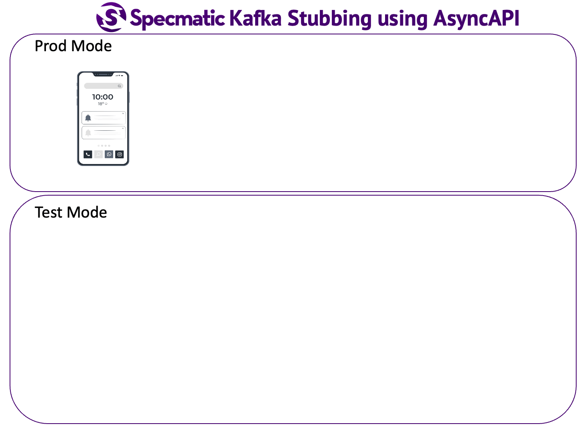

# Specmatic Sample: .NET core BFF calling Domain API

* [Specmatic Website](https://specmatic.io)
* [Specmatic Documentation](https://specmatic.io/documentation.html)

This sample project demonstrates below aspects of Contract-Driven Development
* Contract testing a .NET core (C#) application by leveraging its OpenAPI spec to generate tests (#NOCODE)
* Service Virtualization (Stub / Mock) dependencies of this application (System Under Test), again using OpenAPI specifications of those dependency services

## Background

The Backend For Frontend (BFF) application here is the System Under Test (SUT). It depends on Domain API service which is being Stubbed out using Specmatic thereby effectively isolating the SUT so that we can now use Specmatic to run Contract Tests. Both Service Stubbing and Contract Testing is based on OpenAPI specifications here.



## Tech Stack
1. .NET core
2. Specmatic
3. Test Containers
4. Docker Desktop (on local) and Test Container Cloud (on CI)

# Runing Tests

This will start the specmatic stub server for domain api using the information in specmatic.yaml and run contract tests using Specmatic.
1. Using Terminal -
   ```shell
     dotnet test
   ```
2. Using docker -
    - Start Docker Desktop
    - Run the application `dotnet run`
    - Navigate to test Project (`/specmatic-order-bff-csharp.test`)
    - Start the stub Server `docker run -v "$PWD/specmatic.yaml:/usr/src/app/specmatic.yaml" -p 8090:9000 znsio/specmatic stub`
    - Run the tests `docker run --network host -v "$PWD/specmatic.yaml:/usr/src/app/specmatic.yaml" -v "$PWD/build/reports/specmatic:/usr/src/app/build/reports/specmatic"  znsio/specmatic test --port=8080 --host=host.docker.internal`

# Break down each component to understand what is happening

### Prerequisites

1. Docker Desktop
2. Dotnet SDK
3. If you are on a Windows OS, please use PowerShell.

### Start the dependent components

1. Start domain api stub server

```shell
docker run -v "$PWD/specmatic.yaml:/usr/src/app/specmatic.yaml" -p 8090:9000 znsio/specmatic stub
```

## Start BFF Server
This will start the .NET core BFF server
```shell
dotnet run
```

## Test if everything is working

Note: For Windows OS, add `.exe` extension to curl command on PowerShell or use `cmd.exe` instead.

```shell
curl -H "pageSize: 10" "http://localhost:8080/findAvailableProducts"
```

You result should look like:
```json
[{"id":698,"name":"NUBYR","type":"book","inventory":278}]
```

Also observe the logs in the Specmatic HTTP Stub Server.
